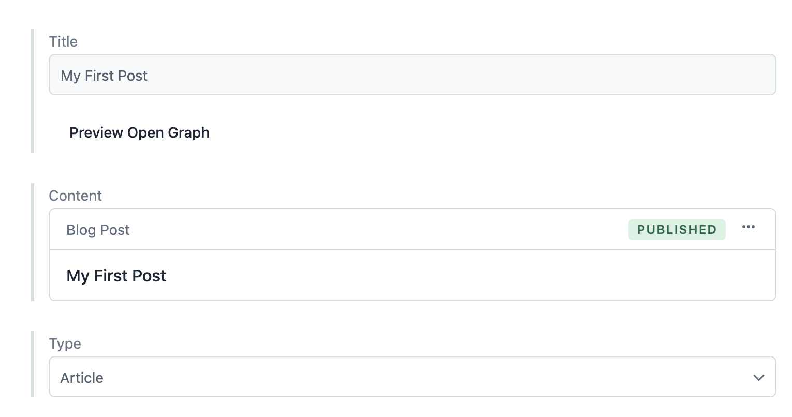
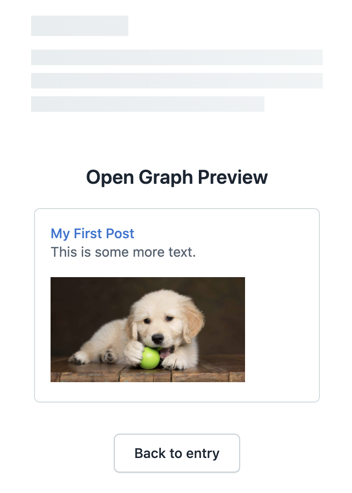

# Open Graph Preview

The Open Graph Preview App for Contentful provides a visualization of an open graph content type.
This app is mainly used for demonstration purposes to show how we can link together 
[app locations](https://www.contentful.com/developers/docs/extensibility/app-framework/locations/)
within the App Framework to provide a cohesive experience for users.

This app extends a short text field, uses data from a reference field, and combines data
to visualize it in a page location.

The field:

The page location:

## Understanding how multiple locations communicate with each other

#### Making a network call via the SDK inside a change event
We make a network call inside of the `onValueChange` of another field in [src/components/Field.tsx:39](https://github.com/davidfateh/ctfl-open-graph/blob/main/src/components/Field.tsx#L39)

#### Making multiple network calls on the page location
In order to collate data from reference, we make two network calls in [src/components/Page.tsx:98](https://github.com/davidfateh/ctfl-open-graph/blob/main/src/components/Page.tsx#L98).
This is done in a `Promise.all` and once resolved, will be used by the render method.

#### Using the URL on a page location to inject data
The `Button` component in the field to preview an Open Graph entry uses
[`sdk.navigator`](https://www.contentful.com/developers/docs/extensibility/app-framework/sdk/#navigator)
to open a page location while injecting the `path`. In our case, we inject the entry ID on
[src/components/Field.tsx:56](https://github.com/davidfateh/ctfl-open-graph/blob/main/src/components/Field.tsx#L56)
and read that information to make more network calls in the page location at
[src/components/Page.tsx:88](https://github.com/davidfateh/ctfl-open-graph/blob/main/src/components/Page.tsx#L88)
by using `sdk.parameters.invocation.path`.

## Developing and extending this project
This project was bootstrapped with [Create Contentful App](https://github.com/contentful/create-contentful-app).

### Available Scripts

In the project directory, you can run:

#### `npm start`

Creates or updates your app definition in contentful, and runs the app in development mode.
Open your app to view it in the browser.

The page will reload if you make edits.
You will also see any lint errors in the console.

#### `npm run build`

Builds the app for production to the `build` folder.
It correctly bundles React in production mode and optimizes the build for the best performance.

The build is minified and the filenames include the hashes.
Your app is ready to be deployed!

## Libraries to use

To make your app look and feel like Contentful use the following libraries:

- [Forma 36](https://f36.contentful.com/) – Contentful's design system
- [Contentful Field Editors](https://www.contentful.com/developers/docs/extensibility/field-editors/) – Contentful's field editor React components

## Learn More

[Read more](https://www.contentful.com/developers/docs/extensibility/app-framework/create-contentful-app/) and check out the video on how to use the CLI.

Create Contentful App uses [Create React App](https://create-react-app.dev/). You can learn more in the [Create React App documentation](https://facebook.github.io/create-react-app/docs/getting-started) and how to further customize your app.
